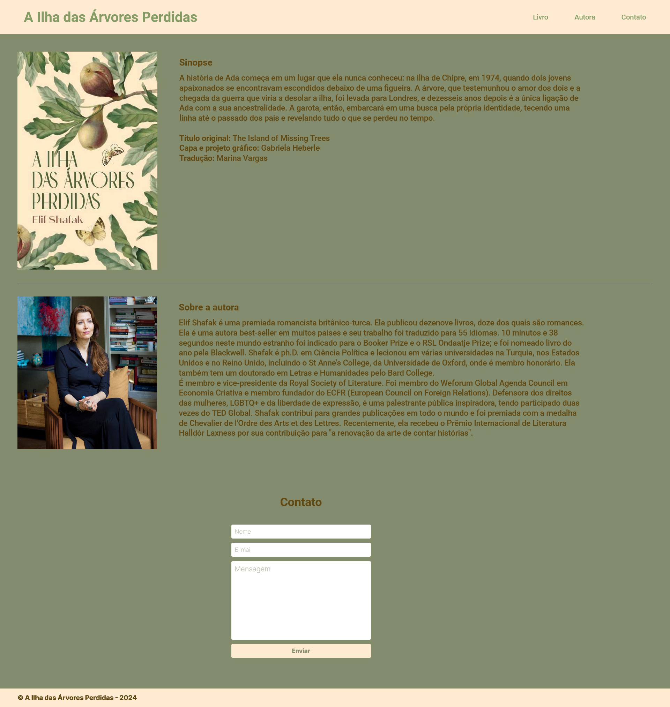

# Landing page - The Island of Missing Trees (A Ilha das Árvores Perdidas)

This application serves as a landing page for the book 'The Island of Missing Trees,' written by Elif Shafak. It includes the story synopsis, information about this particular edition, and details about the author.

## Index
- <a href="#functionalities">Application functionalities</a>
- <a href="#layout">Layout</a>
- <a href="#demonstration">Demonstration</a>
- <a href="#tecnologies-used">Tecnologies used</a>
- <a href="#developer">Developer</a>
- <a href="#next-steps">Next steps</a>

## Application functionalities
 - [x]  Navigate through the page's sections (Book, Author and Contact us)

## Layout

## Demonstration
[Link (deploy)](https://a-ilha-das-arvores-perdidas-landingpage.vercel.app/)

## Tecnologies used
1. HTML
2. CSS

## Developer
[LinkedIn](https://www.linkedin.com/in/julia-silva-borges/)

## Next steps
 - [ ] Add responsivity for different screen sizes.
